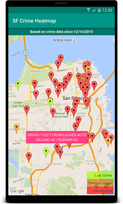

San Francisco Crime Heatmap Android
---

### What is this repository for? ###

* Android application that overlays crime data in San Francisco on a map
* Screenshot:

### How do I get set up? ###

* Standard Gradle build. Import into Android Studio and you're good to go!

### Libraries used:
* Retrofit 2
* Dagger 2
* Butterknife
* Jodatime Android 2.9.1
* RxAndroid 1.1
* Retrolambda 3.2.4